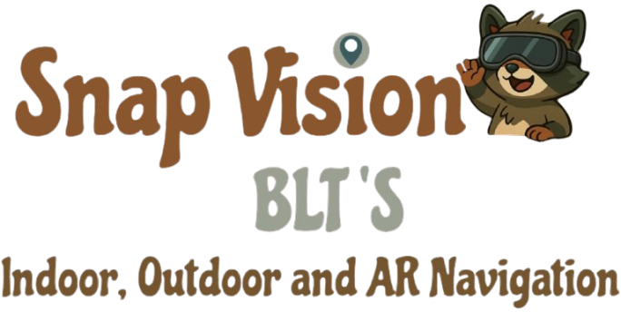

<link href="https://fonts.googleapis.com/css2?family=Chicle&display=swap" rel="stylesheet">
<div align="center">
  
</div>

---

<div align="center">
  <!-- Badge Buttons -->
  <a href="https://img.shields.io/badge/requirement-complete-brightgreen">
    
  </a>
  <a href="https://img.shields.io/codecov/c/github/COS301-SE-2025/Snap-Vision">
    
  </a>
  <a href="https://img.shields.io/github/last-commit/COS301-SE-2025/Snap-Vision">
    
  </a>
  <a href="https://github.com/COS301-SE-2025/Snap-Vision/issues">
    
  </a>
  <a href="https://img.shields.io/github/issues-closed/COS301-SE-2025/Snap-Vision">
    
  </a>
  <a href="https://github.com/COS301-SE-2025/Snap-Vision/pulls">
    
  </a>
  <a href="https://github.com/COS301-SE-2025/Snap-Vision/pulls?q=is%3Apr+is%3Aclosed">
    
  </a>
  <a href="https://github.com/COS301-SE-2025/Snap-Vision/actions/workflows/ci.yml?branch=dev">
    
  </a>
  <a href="https://img.shields.io/github/languages/top/COS301-SE-2025/Snap-Vision">
    
  </a>
  <a href="https://img.shields.io/github/languages/count/COS301-SE-2025/Snap-Vision">
    
  </a>
</div>

---

<div align="center">

<div align="center">
  
</div>

Snap Vision is a mobile application designed to help users navigate complex indoor and outdoor environments such as university campuses and malls using <span style="color:#FF6347;">AR-powered visual guidance</span>. The app uses a combination of GPS, QR Codes, and AR overlays to provide seamless real-time wayfinding.

</div>

<div align="center">

https://github.com/user-attachments/assets/6584b47d-4c81-4fc0-b771-a7e7cf847c33

</div>


<div align="center">
<a href="https://cos301-se-2025.github.io/Snap-Vision/"><button style="background-color:#1E90FF;color:white;border:none;padding:8px 16px;border-radius:6px;cursor:pointer;">Website</button></a>
</div>

---

<div align="center">

|  Links |
|-------|
| [Software Requirements Specification](docs/Software%20Requirements%20Specification%20-%20V4.pdf) |
| [Coding Standards Document](docs/Coding%20Standards%20Document%20-%20V4.pdf) |
| [Testing Policy Document](docs/Testing%20Policy%20Document%20-%20V4.pdf) |
| [GitHub Project Board](https://github.com/orgs/COS301-SE-2025/projects/153) |
| [User Manual](docs/User%20Manual%20Document%20-%20V4.pdf) |
---

<div align="center">
  
</div>

<details>
<summary><strong>Team Members</strong></summary>

<div align="center">
  
</div>

### <span style="color:#FF6347;">Bahiya Hoosen</span>  
Hey! I’m Bahiya — a code-loving, chaos-wrangling Computer Science student with a flair for turning logic into creativity and bugs into personal vendettas. I code, I plan, I color-code task boards like it’s a competitive sport — and still find myself debugging at 2am, whispering “please work” to my IDE. Exploring the digital realms one algorithm at a time, powered by curiosity, caffeine, and an ungodly number of browser tabs. </br>
<div align="center">
<a href="https://github.com/bahiya666"><button style="background-color:#1E90FF;color:white;border:none;padding:6px 12px;border-radius:5px;cursor:pointer;">GitHub</button></a> 
• 
<a href="https://www.linkedin.com/in/bahiya-hoosen-104291254/"><button style="background-color:#0077B5;color:white;border:none;padding:6px 12px;border-radius:5px;cursor:pointer;">LinkedIn</button></a> 
• 
<a href="docs\bahiyacv.pdf"><button style="background-color:#32CD32;color:white;border:none;padding:6px 12px;border-radius:5px;cursor:pointer;">CV</button></a>

[bahiyahoosen6@gmail.com](mailto:bahiyahoosen6@gmail.com)  
</div>

---

### <span style="color:#FF6347;">Lekisha Chetty</span>  
Hi! I'm Lekisha, a curious and motivated BSc Information and Knowledge Systems student who enjoys cracking complex problems and writing code that (usually) behaves itself. I’m an avid programmer and enjoy using creative solutions to tackle challenges across different programming languages. Whether I’m debugging mysterious errors or learning a new tech stack, I love the process of continuous growth. </br>
<div align="center">
<a href="https://github.com/lekishachetty"><button style="background-color:#1E90FF;color:white;border:none;padding:6px 12px;border-radius:5px;cursor:pointer;">GitHub</button></a> 
• 
<a href="docs\Lekisha_CV.pdf"><button style="background-color:#32CD32;color:white;border:none;padding:6px 12px;border-radius:5px;cursor:pointer;">CV</button></a>

[chettylekisha@gmail.com](mailto:chettylekisha@gmail.com)  
</div>

---

### <span style="color:#FF6347;">Tishana Reddy</span>  
Hi! I'm a third-year BSc Computer Science student at the University of Pretoria. I’m passionate about solving real-world problems and I love working on projects that mix creativity with code. For Snap Vision, I’ve been hands-on with all sorts of things—from brainstorming features to debugging (and re-debugging) things that worked five minutes ago. I enjoy learning as I go, building cool things with my team, and occasionally shouting "it works!" at my screen.
Let’s build something awesome! </br>
<div align="center">
<a href="https://github.com/tishreddy"><button style="background-color:#1E90FF;color:white;border:none;padding:6px 12px;border-radius:5px;cursor:pointer;">GitHub</button></a>
• 
<a href="https://www.linkedin.com/in/tishana-reddy-91ba8b23a/"><button style="background-color:#0077B5;color:white;border:none;padding:6px 12px;border-radius:5px;cursor:pointer;">LinkedIn</button></a>

[tishanareddy10@gmail.com](mailto:tishanareddy10@gmail.com)  
</div>

---

### <span style="color:#FF6347;">Thuwayba Dawood</span>  
As a computer science student, I strongly believe in the importance of critical thinking skills, creative problem solving and attention to detail. Through my experience thus far, I have been able to work with multiple programming languages. This has allowed me to solve complex problems through unique solutions. I believe that collaboration with others is key to improving my own understanding of the world of computer science, both within university and beyond. </br>
<div align="center">
<a href="https://github.com/Thuwayba15"><button style="background-color:#1E90FF;color:white;border:none;padding:6px 12px;border-radius:5px;cursor:pointer;">GitHub</button></a>
• 
<a href="https://www.linkedin.com/in/thuwayba-dawood-b99b862b6"><button style="background-color:#0077B5;color:white;border:none;padding:6px 12px;border-radius:5px;cursor:pointer;">LinkedIn</button></a>
• 
<a href="docs\Curriculum Vitae -Thuwayba Dawood.pdf"><button style="background-color:#32CD32;color:white;border:none;padding:6px 12px;border-radius:5px;cursor:pointer;">CV</button></a>

[thuwaybadawood15@gmail.com](mailto:thuwaybadawood15@gmail.com)  
</div>

---

### <span style="color:#FF6347;">Saalihah Sacoor</span>  
Hey there, Saalihah here! I'm a CS student who loves solving problems, delving into the programming world and occasionally wondering why my program works when it really shouldn't. When I'm not wrangling code in front of a dimly lit screen, you'll find me trying to reconnect with nature doing a 5k run at sunrise or strategizing on the netball court. </br>
<div align="center">
<a href="https://github.com/s-sacoor8"><button style="background-color:#1E90FF;color:white;border:none;padding:6px 12px;border-radius:5px;cursor:pointer;">GitHub</button></a>
• 
<a href="https://www.linkedin.com/in/s-sacoor"><button style="background-color:#0077B5;color:white;border:none;padding:6px 12px;border-radius:5px;cursor:pointer;">LinkedIn</button></a>

[saalihahsacoor@gmail.com](mailto:saalihahsacoor@gmail.com)  
</div>

</details>
</div>

---

<div align="center">
  
</div>

<div align="center">
  <a href="docs\Demo Video 4.mp4"><button style="background-color:#1E90FF;color:white;border:none;padding:8px 16px;border-radius:6px;cursor:pointer;">Demo Video</button></a>
</div>

---

<div align="center">
  
</div>
Snap Vision's main research area focuses on indoor navigation and the algorithm associated with it. Our algorithm takes graph-based pathfinding to the next level by accounting for stairs, elevators and accessibility options.  
Key innovations include:</br>
-Multi-floor spatial graph algorithm connecting rooms and paths in Firestore for efficient route computation.</br>  
-Benchmarking against conventional Dijkstra and A* algorithms to measure latency, scalability, and user experience improvements.</br>  
-Evaluating user needs and experience for indoor environments.</br>

---

<div align="center">
  
</div>
<div align="center">
<a href="https://github.com/COS301-SE-2025/Snap-Vision/releases/download/v2.0/snap-vision.apk"><button style="background-color:#1E90FF;color:white;border:none;padding:8px 16px;border-radius:6px;cursor:pointer;">Download APK</button></a>
</div>

---

<div align="center">
  
</div>

```bash
# Clone the repository
git clone https://github.com/COS301-SE-2025/Snap-Vision.git

# Navigate to the correct directory
cd snap-vision

# Install dependencies
npm install

# Start the server
npx react-native start
```
<div align="center">
  Contact us: 

[bltscapstone@gmail.com](mailto:bltscapstone@gmail.com)  
</div>

---

<div align="center">
  
</div>